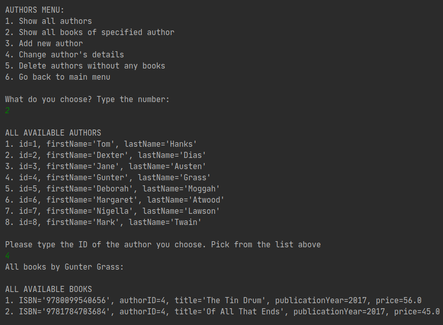

# Java exercise 6 - Home book catalog

1 day exercise, aiming at creating application to manage home library catalog, with limited time but with focus on proper class structure and used design patterns.

## Exercise's requirements

* Program is a simple console application, with psql database
* The program prints a menu and sub-menus with all available options
* Program is foolproof and sql-injection-proof 
* MVCS and DAO patterns are implemented within the application, project is devided into reasonable packages
* Project fulfills the objectives of OOP and clean code
* The exceptions are handled properly

## Program's scope

With this application the user can:
* Add new books, writers and publishers to the database

* See the main menu divided into categories for simpler experience

* Delete books from the database and delete all publishers and creators that don't have any books assigned to them.
* See and modify the details of all books, writers and publishers

* See the clear menus of all sections and have their inputs validated to ensure program's intuitive UX (as for the console application).

## Technologies
* Java SE 13
* IntelliJ + Maven
* PSQL Database (local)

## Status
Project is finished.

## Credits
Project assigned and supervised by Codecool mentors.
